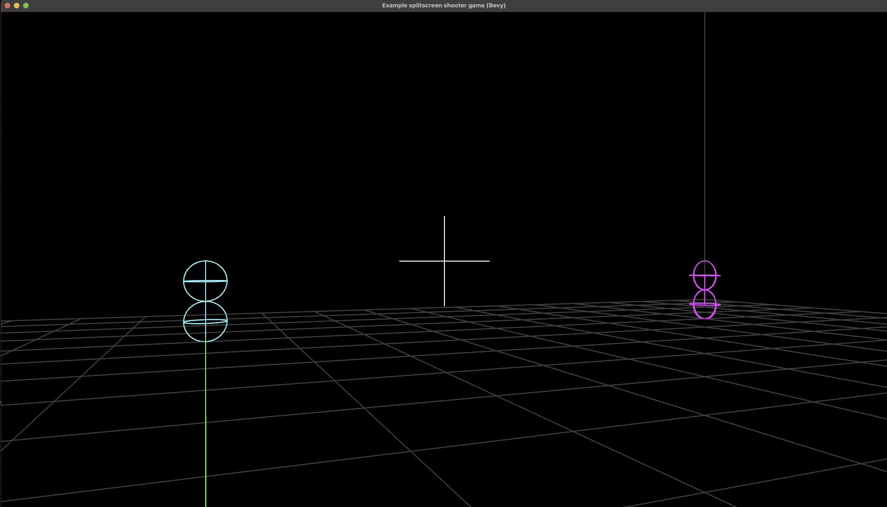

# run

```
cargo r --release

```

<p align="center">
  
</p>

# woodeneye_bevy_ver

- sdl3-rust
  - https://github.com/vhspace/sdl3-rs/tree/master/examples/demo_games
- C 언어 오리지날 코드 -  original code 
  - https://github.com/libsdl-org/SDL/tree/main/examples/demo/02-woodeneye-008

# mouse 십자선과 감도 조절


```rs

// Mouse-look and WASD for player 0 (simplified mapping from SDL's per-device assignment)
let mut p0 = query.iter_mut().find(|p| p.id == 0).unwrap();

// Mouse-look sensitivity controlling crosshair/camera speed.
// Increase this value to rotate faster; decrease to rotate slower.
let sens = 0.0025; // <-- adjust this to tune sensitivity

```
